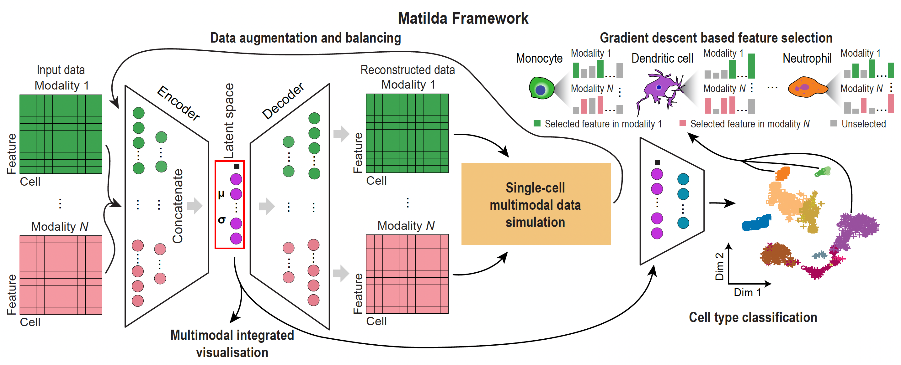

---
tags:
  - getting-started
---
# Quickstart

!!! tip "One model, four tasks"

    Matilda trains **one** multimodal VAE + classifier and reuses it for classification,
    dimension reduction, feature selection, and data simulation. The two interfaces below (the
    Python `matilda-sc` object API and the R object API) drive the *same* model and give the
    same results. See [Installation](installation.md) to set up either one.

---

## End to end in five lines

The example below runs the full workflow on TEA-seq (RNA + ADT + ATAC): **train → reduce →
classify → markers → simulate**. In Python you pass in-memory `AnnData` (one per modality) to
`matilda.train()` then the task verbs; in R you pass a `SingleCellExperiment` (SCE) and let the
model ride along inside the object.

=== "Python"

    ```python
    import matilda
    # rna/adt/atac (reference) and q_rna/q_adt/q_atac (held-out query): one AnnData per modality,
    # with the reference labels in rna.obs["cell_type"] (load: see Installation). labels= also
    # accepts a label vector or a path to a label .csv.

    fit = matilda.train(rna, adt, atac, labels="cell_type")        # 1. train (one shared model)
    red = matilda.reduce({"rna": rna, "adt": adt, "atac": atac}, model=fit)             # 2. latent space
    res = matilda.classify({"rna": q_rna, "adt": q_adt, "atac": q_atac}, model=fit)     # 3. cell types
    mk  = matilda.markers({"rna": rna, "adt": adt, "atac": atac}, model=fit, labels="cell_type")  # 4. markers
    sim = matilda.simulate({"rna": rna, "adt": adt, "atac": atac}, model=fit,
                           celltype="B.Naive", n=200, labels="cell_type")               # 5. synthetic cells
    ```

=== "R"

    ```r
    library(matilda)
    # sce, query: SingleCellExperiment objects (see Installation for loading your data)

    sce   <- matilda_train(sce, label = "cell_type")    # 1. train (model stored in the object)
    sce   <- matilda_reduce(sce)                         # 2. reducedDim "MATILDA"
    query <- matilda_classify(query, reference = sce)    # 3. colData$matilda_pred / $matilda_prob
    mk    <- matilda_markers(sce)                        # 4. per-cell-type feature importance
    sim   <- matilda_simulate(sce, celltype = "B.Naive", n = 200)   # 5. synthetic cells
    ```

---

## What each step does

| Step | Python | R | Result |
|------|--------|---|--------|
| Train | `matilda.train(rna, adt, atac, labels=)` | `matilda_train(sce, label=)` | one shared model |
| Reduce | `matilda.reduce(data, model=)` | `matilda_reduce(sce)` | integrated latent space (`reducedDim "MATILDA"`) |
| Classify | `matilda.classify(query, model=)` | `matilda_classify(query, reference=)` | predicted cell types (`colData$matilda_pred`) |
| Markers | `matilda.markers(data, model=)` | `matilda_markers(sce)` | per-cell-type feature importance |
| Simulate | `matilda.simulate(data, model=, celltype=, n=)` | `matilda_simulate(sce, celltype=, n=)` | synthetic cells |

The trained model is carried as `model=` in Python and `reference=` in R. **`classify` reconciles
features automatically**: it reuses the model when the query shares the reference panel, and
retrains on the reference ∩ query intersection when it doesn't (real values, no zero-padding).
Hyperparameters (`batch_size`, `epochs`, `lr`, `z_dim`, `hidden_rna`, `hidden_adt`, `hidden_atac`,
`seed`, `augmentation`) default to the published settings and are shared verbatim across both APIs.



---

## Next steps

- Full Python walkthrough on TEA-seq: [Python tutorial](tutorial-python.ipynb)
- Full R walkthrough on TEA-seq: [R tutorial](tutorial-r.md)
- Setting up either interface: [Installation](installation.md)
