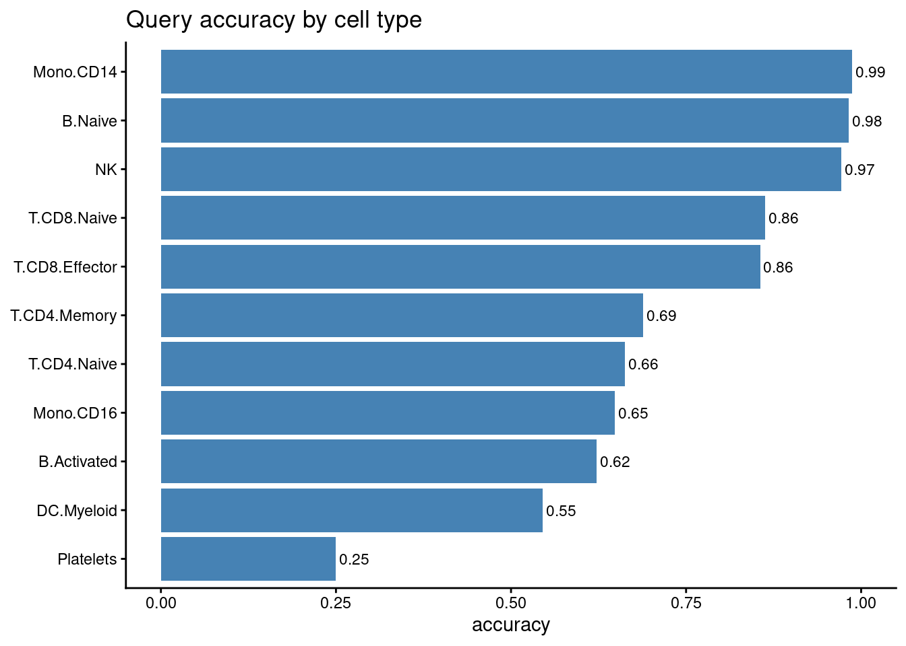
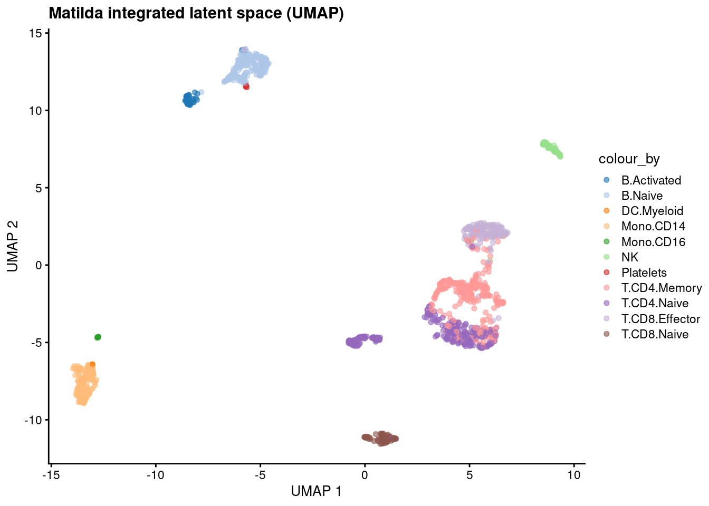
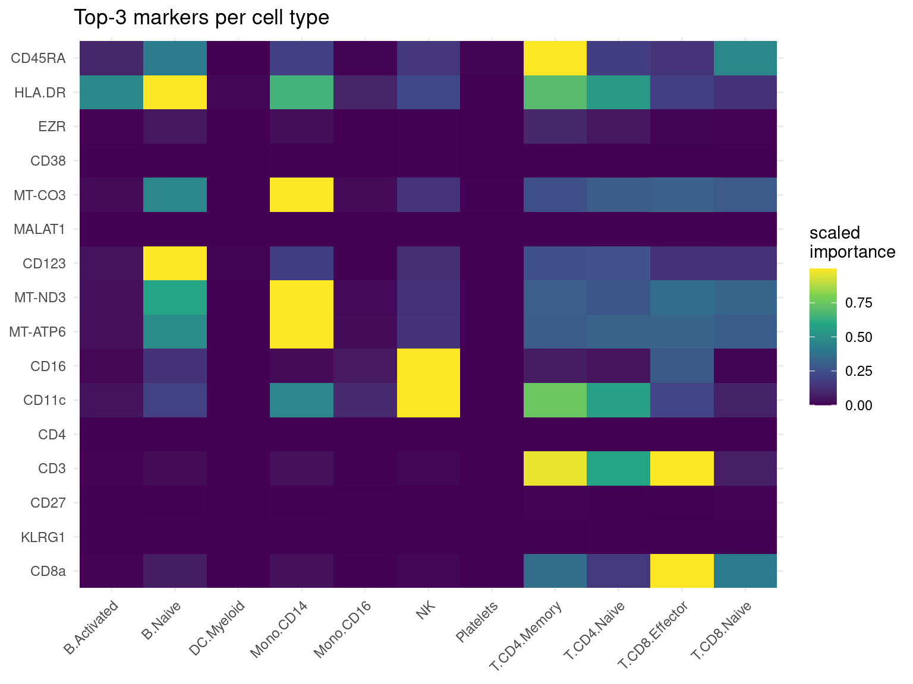
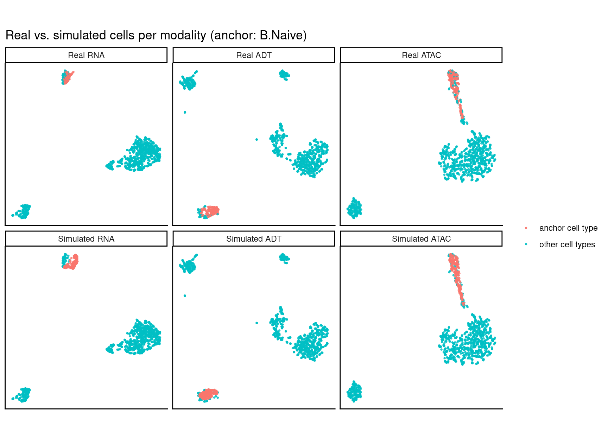
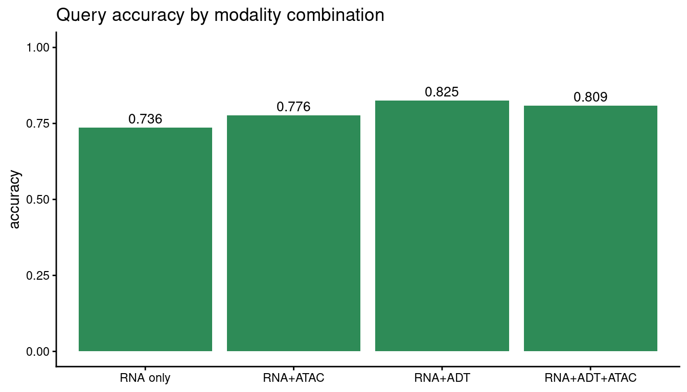

# Matilda in R

Python users see [the Python tutorial](tutorial-python.ipynb).

The complete Matilda workflow in **R** on real **TEA-seq** (RNA + ADT + ATAC): read your data →
train → classification → dimension reduction → feature selection → simulation, plus a look at the
different data types Matilda supports. Python users: a parallel tutorial with the same structure
is available as a Jupyter notebook.

## Requirements

- **R**: `matilda`, `SingleCellExperiment`; `Seurat` for the `10x` and `.rds` loaders; `scater`
  for the latent-space UMAP; `uwot` for the per-modality simulation UMAP (§6); `ggplot2` for plots.
- **Python**: none. `matilda` provisions it via `basilisk` on the first `matilda_train()`.
- **Demo data**: downloaded automatically by `matilda_download_example()` (~75 MB, cached locally).

```r
library(matilda)
library(SingleCellExperiment)
library(ggplot2)                               # plots below use ggplot()/aes() directly
data_dir <- matilda_download_example()         # downloads + caches the TEA-seq demo, returns the path
demo_h5  <- data_dir                            # native .h5 + _cty.csv
demo_fmt <- file.path(data_dir, "formats")      # .h5ad / 10x / .rds

# a fixed colour list, assigned to whichever cell types your data has (works for any labels)
PALETTE <- c("#1f77b4","#aec7e8","#ff7f0e","#ffbb78","#2ca02c","#98df8a","#d62728","#ff9896",
             "#9467bd","#c5b0d5","#8c564b","#c49c94","#e377c2","#f7b6d2","#7f7f7f","#bcbd22","#17becf","#9edae5")
```

## 1. Read your data

Matilda's R interface takes a `SingleCellExperiment`: **RNA raw counts** in the main assay, **ADT**
and **ATAC** (gene activity) as `altExp`s, and a cell-type column in `colData`. Below the *same*
TEA-seq training cells are loaded from **four formats**; pick whichever matches your data.

```r
# assemble an SCE from three genes x cells matrices + a label vector
build_sce <- function(rna, adt, atac, cell_type) {
  sce <- SingleCellExperiment(assays = list(counts = as.matrix(rna)))
  altExp(sce, "ADT")  <- SummarizedExperiment(list(counts = as.matrix(adt)))
  altExp(sce, "ATAC") <- SummarizedExperiment(list(counts = as.matrix(atac)))
  sce$cell_type <- cell_type
  sce
}
labels <- as.character(utils::read.csv(file.path(demo_h5, "train_cty.csv"), header = FALSE)[[2]])[-1]
```

### Format A: native Matilda `.h5` (`rhdf5`)

```r
read_h5 <- function(path) {
  m     <- rhdf5::h5read(path, "matrix/data")
  feats <- as.character(rhdf5::h5read(path, "matrix/features"))
  cells <- as.character(rhdf5::h5read(path, "matrix/barcodes"))
  if (nrow(m) == length(cells) && ncol(m) == length(feats)) m <- t(m)   # -> genes x cells
  dimnames(m) <- list(feats, cells); m
}
g  <- function(mod) file.path(demo_h5, sprintf("train_%s.h5", mod))
sce <- build_sce(read_h5(g("rna")), read_h5(g("adt")), read_h5(g("atac")), labels)
sce
```

### Format B: `.h5ad` (AnnData / scanpy)

A `.h5ad` is just HDF5; read its CSR-sparse `X` with `rhdf5` (no extra Python needed). For a
richer object you could use `zellkonverter::readH5AD()` instead.

```r
rd_h5ad <- function(p) {                                      # -> genes x cells
  X     <- rhdf5::h5read(p, "X")                              # CSR: data / indices / indptr
  shp   <- as.integer(rhdf5::h5readAttributes(p, "X")$shape)  # c(cells, genes)
  genes <- as.character(rhdf5::h5read(p, "var/_index"))
  cells <- as.character(rhdf5::h5read(p, "obs/_index"))
  m <- Matrix::sparseMatrix(i = rep(seq_len(shp[1]), diff(X$indptr)),
                            j = X$indices + 1L, x = as.numeric(X$data), dims = shp)  # cells x genes
  m <- Matrix::t(m); dimnames(m) <- list(genes, cells); as.matrix(m)
}
h <- function(mod) file.path(demo_fmt, sprintf("train_%s.h5ad", mod))
sce_h5ad <- build_sce(rd_h5ad(h("rna")), rd_h5ad(h("adt")), rd_h5ad(h("atac")), labels)
```

### Format C: 10x CellRanger (`Seurat::Read10X`)

```r
rd_10x <- function(d) as.matrix(Seurat::Read10X(d))
x <- function(mod) file.path(demo_fmt, "10x", sprintf("train_%s", mod))
sce_10x <- build_sce(rd_10x(x("rna")), rd_10x(x("adt")), rd_10x(x("atac")), labels)
```

### Format D: a `Seurat` object (`.rds`)

```r
seu  <- readRDS(file.path(demo_fmt, "train_seurat.rds"))            # RNA/ADT/ATAC assays + cell_type
ga   <- function(a) as.matrix(SeuratObject::LayerData(seu, assay = a, layer = "counts"))
sce_rds <- build_sce(ga("RNA"), ga("ADT"), ga("ATAC"), seu$cell_type)
```

All four give the same object, so the rest of the tutorial doesn't depend on the format. We
continue with `sce` from Format A.

## 2. Train the Matilda model

The model is stored inside the object, so the workflow pipes.

```r
sce <- matilda_train(sce, label = "cell_type", seed = 1L)
matilda_model(sce)
```

## 3. Classification (held-out query cells)

```r
query <- build_sce(read_h5(file.path(demo_h5, "test_rna.h5")),
                   read_h5(file.path(demo_h5, "test_adt.h5")),
                   read_h5(file.path(demo_h5, "test_atac.h5")),
                   as.character(utils::read.csv(file.path(demo_h5, "test_cty.csv"), header = FALSE)[[2]])[-1])
query <- matilda_classify(query, reference = sce)
sprintf("overall query accuracy = %.4f", mean(query$matilda_pred == query$cell_type))
```

```r
# per-cell-type accuracy = fraction of each type's query cells labelled correctly
acc_by_type <- tapply(query$matilda_pred == query$cell_type, query$cell_type, mean)

ggplot(data.frame(cell_type = names(acc_by_type), accuracy = as.numeric(acc_by_type)),
       aes(reorder(cell_type, accuracy), accuracy)) +
  geom_col(fill = "steelblue") +
  coord_flip() +
  ylim(0, 1) +
  geom_text(aes(label = sprintf("%.2f", accuracy)), hjust = -0.1, size = 3) +
  labs(title = "Query accuracy by cell type", x = NULL, y = "accuracy") +
  theme_classic()
```



## 4. Dimension reduction

```r
sce <- matilda_reduce(sce)                 # adds reducedDim(sce, "MATILDA")
dim(reducedDim(sce, "MATILDA"))            # cells x z_dim (100)
```

```r
set.seed(42)
sce <- scater::runUMAP(sce, dimred = "MATILDA", n_neighbors = 15L, min_dist = 0.1)   # 2-D UMAP of the latent space

cell_types  <- sort(unique(as.character(sce$cell_type)))          # colour whatever cell types the data has
palette_map <- setNames(PALETTE[(seq_along(cell_types) - 1) %% length(PALETTE) + 1], cell_types)  # wrap if >18 types

scater::plotUMAP(sce, colour_by = "cell_type") +
  ggplot2::scale_colour_manual(values = palette_map) +
  ggtitle("Matilda integrated latent space (UMAP)")
```



## 5. Feature selection

```r
markers <- matilda_markers(sce)            # data.frame: celltype / feature / importance
head(markers)
```

```r
# take each cell type's top-3 markers, then build a feature x cell-type importance grid
cell_types <- sort(unique(markers$celltype))
top3 <- do.call(rbind, lapply(cell_types, function(ct) {
  rows <- markers[markers$celltype == ct, ]
  head(rows[order(-rows$importance), ], 3)
}))
feature_order <- unique(top3$feature)

heat_df <- markers[markers$feature %in% feature_order, ]
# min-max scale each feature's importance across cell types to 0..1 (comparable within a row)
heat_df$imp_scaled <- ave(heat_df$importance, heat_df$feature,
                          FUN = function(z) (z - min(z)) / (max(z) - min(z) + 1e-9))
heat_df$feature  <- factor(heat_df$feature,  levels = rev(feature_order))
heat_df$celltype <- factor(heat_df$celltype, levels = cell_types)

ggplot(heat_df, aes(celltype, feature, fill = imp_scaled)) +
  geom_tile() +
  scale_fill_viridis_c() +
  theme_minimal() +
  theme(axis.text.x = element_text(angle = 45, hjust = 1)) +
  labs(title = "Top-3 markers per cell type", x = NULL, y = NULL, fill = "scaled\nimportance")
```



## 6. Simulation

Matilda **augments** a chosen **anchor** cell type: in the returned set that one type is replaced by
`n` freshly generated synthetic cells, while **every other cell type stays real**. The returned
object also carries the full **real** reference cells Matilda used (`metadata(sim)$real`), in the
**same feature space**, so the two are directly comparable. The official check: per modality, UMAP
the real and simulated sets together, then show the real cells
(top row) and the augmented set (bottom row), highlighting the anchor. The bottom row is labelled
"Simulated", but only the **anchor** group in it is synthetic — the other types are the real cells;
if augmentation works, the synthetic anchor lands where the real anchor is in the top row.

```r
sim  <- matilda_simulate(sce, celltype = "B.Naive", n = 200)
real <- S4Vectors::metadata(sim)$real        # the full real reference cells (same space as the simulation)
c(total_in_sim = ncol(sim), synthetic_anchor = sum(sim$label == "B.Naive"), real_reference = ncol(real$rna))
```

```r
real_mat <- list(RNA = real$rna, ADT = real$adt, ATAC = real$atac)
sim_mat  <- list(RNA  = SummarizedExperiment::assay(sim, "counts"),
                 ADT  = SummarizedExperiment::assay(SingleCellExperiment::altExp(sim, "ADT"),  "counts"),
                 ATAC = SummarizedExperiment::assay(SingleCellExperiment::altExp(sim, "ATAC"), "counts"))

# tag each cell: the anchor type vs everything else
anchor_tag <- function(lab) factor(ifelse(lab == "B.Naive", "anchor cell type", "other cell types"),
                                   levels = c("anchor cell type", "other cell types"))

# per modality: top-1000 variable features -> scale -> PCA -> UMAP, then split real vs simulated
one_modality <- function(mod) {
  stacked  <- t(cbind(real_mat[[mod]], sim_mat[[mod]]))           # cells x features
  n_real   <- ncol(real_mat[[mod]])
  n_sim    <- ncol(sim_mat[[mod]])
  top_var  <- order(apply(stacked, 2, stats::var), decreasing = TRUE)[seq_len(min(1000L, ncol(stacked)))]
  z_scaled <- scale(stacked[, top_var])
  pcs <- stats::prcomp(z_scaled, rank. = min(50L, ncol(z_scaled) - 1L),
                       center = FALSE, scale. = FALSE)$x          # denoise before UMAP
  set.seed(42)
  umap_df <- as.data.frame(uwot::umap(pcs, n_neighbors = 20, min_dist = 0.1, init = "pca"))
  names(umap_df) <- c("UMAP1", "UMAP2")
  rbind(data.frame(umap_df[seq_len(n_real), ],         grp = anchor_tag(real$label), panel = paste("Real", mod)),
        data.frame(umap_df[n_real + seq_len(n_sim), ], grp = anchor_tag(sim$label),  panel = paste("Simulated", mod)))
}

plot_df <- do.call(rbind, lapply(c("RNA", "ADT", "ATAC"), one_modality))
plot_df$panel <- factor(plot_df$panel, levels = c("Real RNA", "Real ADT", "Real ATAC",
                                                  "Simulated RNA", "Simulated ADT", "Simulated ATAC"))
ggplot(plot_df, aes(UMAP1, UMAP2, colour = grp)) +
  geom_point(size = 0.5, alpha = 0.8) +
  facet_wrap(~ panel, nrow = 2, scales = "free") +
  ggplot2::scale_colour_manual(values = c("anchor cell type" = "#F8766D", "other cell types" = "#00BFC4")) +
  theme_classic() +
  theme(axis.text = element_blank(), axis.ticks = element_blank(),
        legend.title = element_blank(), aspect.ratio = 1) +
  labs(x = NULL, y = NULL, title = "Real vs. simulated cells per modality (anchor: B.Naive)")
```



## 7. Modality combinations Matilda supports

Matilda works with **any combination of the three modalities** (RNA only, RNA + ADT, RNA + ATAC,
or RNA + ADT + ATAC) and picks the matching model automatically from what you provide. (Internally
Matilda labels these `rna_only` / `CITEseq` / `SHAREseq` / `TEAseq`, after the assays they typically
come from, but your data needn't be those specific protocols; only the modalities present matter.)
Training each combination on the *same* cells shows what each added modality buys; to use your own
data, just build the SCE with whatever modalities you have.

```r
# drop the altExps not in `keep`, leaving only the requested modalities
keep_only <- function(s, keep) {
  for (ae in altExpNames(s)) if (!(ae %in% keep)) altExp(s, ae) <- NULL
  s
}
combo_acc <- sapply(list("RNA only" = character(0), "RNA+ATAC" = "ATAC", "RNA+ADT" = "ADT"),
  function(keep) {
    fit <- matilda_train(keep_only(sce, keep), label = "cell_type", seed = 1L)
    qy  <- matilda_classify(keep_only(query, keep), reference = fit)
    mean(qy$matilda_pred == qy$cell_type)
  })
combo_acc["RNA+ADT+ATAC"] <- mean(query$matilda_pred == query$cell_type)   # the TEA-seq model from §2/§3

ggplot(data.frame(modalities = factor(names(combo_acc), levels = names(combo_acc)),
                  accuracy = as.numeric(combo_acc)),
       aes(modalities, accuracy)) +
  geom_col(fill = "seagreen") +
  ylim(0, 1) +
  geom_text(aes(label = sprintf("%.3f", accuracy)), vjust = -0.4, size = 3.5) +
  labs(title = "Query accuracy by modality combination", x = NULL, y = "accuracy") +
  theme_classic()
```



Adding the ADT (protein) panel to RNA gives the biggest gain; ATAC contributes less for this task
on this dataset.

## 8. Session info

```r
sessionInfo()
```
